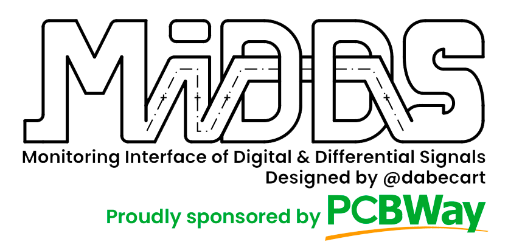
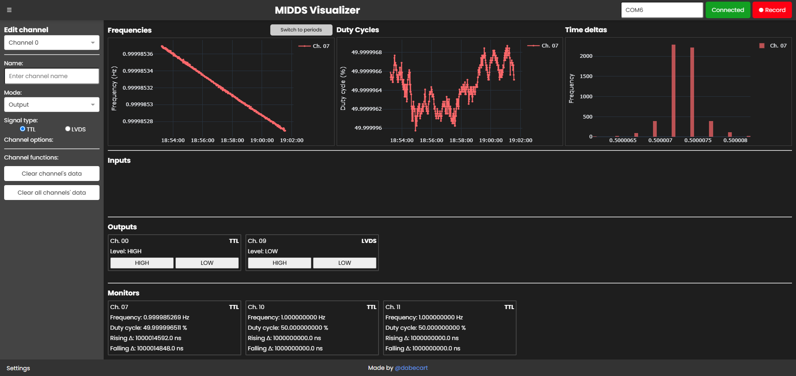

# MIDDS
*Monitoring Interface of Digital and Differential Signals. By @dabecart, 2025.*

✨ This project was sponsored by [**PCBWay**](#a-huge-thank-you-to-pcbway) ✨

**Are you looking for the PROTO-MIDDS repo?** [Here you have it!](https://github.com/dabecart/PROTO-MIDDS)

## Overview

The **MIDDS** is a peripheral board designed to connect to a computer via USB, enhancing your software with timestamped GPIO capabilities. More than just a reliable General-Purpose Input/Output device, it delivers precise and high-accuracy timestamping. Featuring 14 configurable channels, the MIDDS supports +3.3V TTL or LVDS input and output modes. These channels enable timestamping for both inputs and outputs, with each channel capable of being selected as the SYNC input. This SYNC input can accept a rectangular signal from an external clock source to synchronize the MIDDS's time with the external clock. MIDDS also has 16 additional GPIOs (only for +3.3V TTL).

For even greater precision, the MIDDS supports an external clock signal as HCLK, which can be connected through an onboard SMA connector. The board also includes a TFT LCD screen for convenient display of the monitor's current state. Additionally, the MIDDS offers 16 extra GPIOs, configurable as digital or analog inputs/outputs. All external connections are ESD-protected.

The MIDDS solves two problems on the same device:

- For one, it works as a digital oscilloscope of high timing accuracy relative to its price.
- And it works as a GPIO card, allowing the computer to generate both input and output signals, TTL and LVDS!

It can therefore be used in the following applications:

- Cost-effective laboratory equipment and instrumentation.
- Sensor calibration.
- Multi-protocol interface adapter (SPI, I2C).
- Board to board communication.
- GNSS.
- Test and measurement.

## How MIDDS works?
Read more about it [here](/docs/README.md)! 💫

# MIDDS Visualizer

The **MIDDS Visualizer** is a graphic tool used to configure and visualize in real time the data sent by MIDDS. Learn more about it [here](https://github.com/dabecart/MIDDS-Visualizer).

# A Huge Thank You to PCBWay! 

Whether you're a hobbyist, engineer, or student, I feel confident in saying that they're the go-to destination for high-quality PCB manufacturing and prototyping.

Here are just a few of the reasons why PCBWay stands out:

✅ Top-notch Quality: After thoroughly inspecting all of the PCBs of my project, I was content with the great precision the PCBs were made. I felt they are reliable and durable!

✅ Fast Turnaround: The whole ordering, manufacturing and shipping of 50 PCBs to Spain took around a week and a half, which is most impressing! 

✅ Affordable Pricing: Their competitive rates make professional-grade PCBs accessible to everyone.

✅ Excellent Support: From order placement to final delivery, PCBWay’s team was always there to answer my questions and provide guidance.

Thanks to their expertise and dedication, I was able to turn my ideas for this project into reality without a hitch. If you’re working on your next PCB project, I can’t recommend PCBWay enough!

🎉 Visit [**PCBWay.com**](https://www.pcbway.com/) and experience their amazing service for yourself!

✨ And a final thanks to PCBWay for their patronage! ✨

# License
This project is licensed under MIT License. Read the [LICENSE file](/LICENSE).