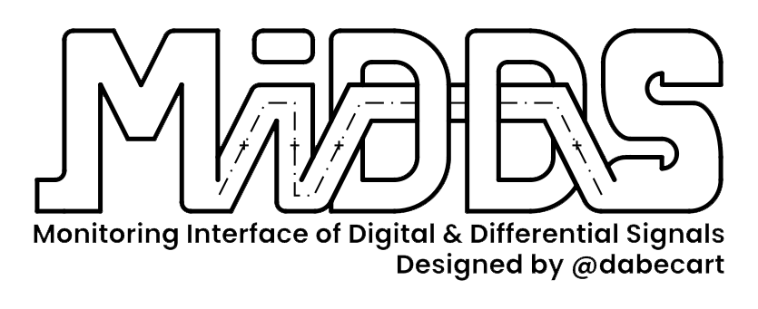

# MIDDS
*Monitoring Interface of Digital and Differential Signals, by @dabecart.*

## Overview

The **MIDDS** is a peripheral board to connect to a computer via Ethernet that adds GPIO capabilities to your software. The Monitor does not only work as a reliable General-Purpose Input/Output but also offers high accuracy timestamping. It accepts both TTL and LVDS signals, in the 0V-5V range, and it has a dedicated input to feed your own SYNC signal to synchronize an external clock source with the device. It also has a TFT LCD screen that easily displays the current state of the monitor.

The MIDDS solves two problems on the same device:

- For one, it works as a digital oscilloscope of high timing accuracy relative to its price.
- And it works as a GPIO card, allowing the computer to generate both input and output signals.

It can therefore be used in the following applications:

- Cost-effective laboratory equipment and instrumentation.
- Sensor calibration.
- Multi-protocol interface adapter (SPI, I2C).
- Board to board communication.
- GPS.
- Test and measurement.

## How it works
Read more about it [here](docs\README.md)!

# License
This project is licensed under MIT License. Read the [LICENSE file](LICENSE).