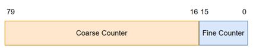

# MIDDS
*Monitoring Interface of Digital and Differential Signals, by @dabecart.*

<!-- Revise if the final CLK frequency is 25MHz or 10MHz -->

## Overview

The **MIDDS** is a peripheral board designed to connect to a computer via USB, enhancing your software with timestamped GPIO capabilities. More than just a reliable General-Purpose Input/Output device, it delivers precise and high-accuracy timestamping. Featuring 14 configurable channels, the MIDDS supports TTL or LVDS input and output modes. These channels enable timestamping for both inputs and outputs, with each channel capable of being selected as the SYNC input. This SYNC input can accept a square signal from an external clock source to synchronize the MIDDS's time with the external clock.

For even greater precision, the MIDDS supports an external clock signal as HCLK, which can be connected through an onboard SMA connector. The board also includes a TFT LCD screen for convenient display of the monitor's current state. Additionally, the MIDDS offers 16 extra GPIOs, configurable as digital or analog inputs/outputs. All external connections are ESD-protected.

The MIDDS solves two problems on the same device:

- For one, it works as a digital oscilloscope of high timing accuracy relative to its price.
- And it works as a GPIO card, allowing the computer to generate both input and output signals.

It can therefore be used in the following applications:

- Cost-effective laboratory equipment and instrumentation.
- Sensor calibration.
- Multi-protocol interface adapter (SPI, I2C).
- Board to board communication.
- GPS.
- Test and measurement.

## Hardware versions

There are two versions of the MIDDS in this project: 
- The **prototype** model: easy to build with a prototype board, based around the **STM32G431** MCU. This is used as a proof of concept. 
- The **final** model: implemented in a PCB with the **STM32H753ZIT6** MCU in mind, in particular the **NUCLEO-H753ZI** board.

The following sections will be related to the final model. If the reader was interested in knowing more about the prototype model, click [here](/PROTO_MIDDS/README.md).

## Capabilities

The Monitor takes advantage of the following STM32H753ZIT6 MCU’s features:

- **High Resolution Timer (HRTIM):** it gives accurate measures up to the frequency of the actual clock signal that is feeding the MCU. The desired running frequency for the CPU will be 400 MHz, generated with an external OCXO of 25MHz, 10 ppb.
- **General Purpose Timers (TIMx):** very similar to the HRTIM but working on half the MCU’s clock frequency (200 MHz).
- **Direct Memory Access (DMA):** this will streamline data exchange between the hardware timer and the software running on the MCU, meaning that the time interval between external input and outgoing message to the PC will be close to negligible.
- **Ethernet compliant with IEEE-802.3-2002:** the MCU will stablish connection with the PC via TCP with a bandwidth of 10 MB/s with a simple and fast custom protocol.
- **GPIOs:** the MCU offers up to 112 GPIOs.
  - In this first iteration of the Monitor, ___ GPIOs are expected to be used:
  - Both LVDS and TTL input/outputs can be selectively timestamped with different accuracies: high, medium and low.

With all these features, below are listed the expected measuring characteristics of the MIDDS:

- **Guaranteed less than 5 ns of deviation** between real and measured timestamps in medium and high accuracy inputs.
- Clock deviation after SYNC signal: worst-case scenario of 10 ns/s, 600 ns/min, 36 us/h, 864 us/day. It is therefore recommended to use a SYNC signal of a least 1 Hz for high precision measurements.
- Guaranteed **exact readings of simultaneous signals**.
- Recording of **both rising and falling edges**.
- **Overvoltage protection** on all inputs.
- **High impedance input**, meaning that the Monitor will not affect the input signals.

## Working principle

The MIDDS heavily relies on the hardware timers of the MCU. A timer is basically a 16-bit counter, a module within the chip that increments its value by one at the same rate of the MCU’s clock, in case of the HRTIM; and at half its rate, in the case of TIMx.

The counter’s numerical range is somewhat limited (from 0 to 65535). Although this at first may not appear to be a small number, the MCU’s clock is expected to run at around 400MHz, meaning that the counter will fill up every 163.84 microseconds!

When the counter reaches its upper threshold, an overflow occurs, and the counter rolls back to zero. Every time this happens, an interruption or ISR is triggered on the MCU. On this ISR, the MCU increments a software 64-bit counter.

Henceforth, the hardware timers (HRTIM and TIMx) will be called the "fine counters" whilst the software counters will be the "coarse counters".

This structure gives a precision-per-bit of 2.5ns (at 400MHz) and a total time count of 3.022 · 1015 seconds (around 96 million years).

Although this number is impressive, it is not very useful to use such large times without keeping a more constraint time of reference. This is because of the relative accuracy of the onboard OCXO of the MCU: by using an OCXO of 25MHz, 10 ppb, for each pulse of a real 25MHz clock, there is a small amount of time which, at maximum, is being lost:

Therefore, every 25 million pulses, there is a maximum drift of ±10ns. This could amount to 10 ns/s, 600 ns/min, 36 us/h or 864 us/day, which for some applications may be unsuited.

This is why the MIDDS also has a SYNC input that allows the user to input its reference pulse signal. This signal will normally come from a more stable and reliable source, such as GPS. The frequency and duty cycle of said pulse signal will need to be specified via software. Unless noted from the computer, the MIDDS will suppose that a 1 PPS signal of 50% duty cycle is being used.

The following is the synchronization sequence of the SYNC signal with the MIDDS clock:

<!-- TODO -->

# Hardware and Software design

In this section, an overview of the hardware and software design is shown.

## Hardware timestamping

The Hardware timers, be it TIMx or HRTIM, consist of a binary counter (16 or 32-bit in size) that increments at an specific rate, normally a multiple of the MCU clock. These timers have an assortment of *channels* which have many functions. In particular, the MIDDS uses a mode called "Capture Input": when an edge is detected on certain pin, the value from the binary counter of the timer gets stored on a register of the channel associated with the pin. This value is stored until it is read from software, albeit it can be overwritten by another input pulse so, if no edge is to be missed, the software must be speedy in its operation.

The MCU has a master timer, the HRTIM. Its binary counter is synchronized with the rest of timers using internal events, such that when HRTIM overflows and resets so they do the rest of timers, that way, all counters are valued with the same "fine counter". This also reduces complexity because from software there is only one overflow event, instead of an event per timer.

After an edge is detected, an interrupt (ISR) is requested. If the interrupt gets served, the MCU reads the "Capture Input register" associated with the input which caused the event to be triggered.

## Selectable Inputs/Outputs with TTL and LVDS levels
The LVDS inputs are similar to their TTL counterparts, it only differs by a "Differential to TTL" converter that is put before the GPIO of the MCU. This converter takes the ±400mV input and converts it into a +3.3V TTL signal and vice versa (this is controlled with the DIRection input). Although not pointed out in the diagram, bear in mind that a LVDS signal needs of two lines to work. Both "Voltage protection" and "Differential to TTL" blocks work on two lines. The TTL signal will be generated referenced to common GND.

## Characteristics of timestamped Inputs/Outputs

The MIDDS has three different types of timestamped I/Os:

- High accuracy, with a precision of 2.5ns.
- Medium accuracy, with a precision of 5ns.
- Low accuracy, with a precision of no more than 1ms, although this may depend on the software load of the MCU.

### High accuracy timestamped I/Os

These I/Os are managed by the HRTIM. The HRTIM has five inner timers which are all fed by the general counter of the HRTIM, that is, all five timers get incremented (if enabled) at the same rate as the general counter. In the case of the MIDDS, all those inner timers will always be enabled, meaning that they will always have the same value as the general counter. Moreover, they have been configured to all be reset at the same time the general counter overflows, guaranteeing the same frame of reference for all timers.

As the HRTIM works at the same rate of the MCU’s clock (400 MHz), each increment of these "fine counters" will be 2.5ns.

Each one of those five individual timers can be triggered by a rising or falling edge. When an edge is detected, the value of the timer is transferred through DMA to memory and when that process ends, an interrupt gets called to process that current timer value.

If the MCU could not attend that interrupt request and another edge came, the timer would be overwritten with the time value of the newly arrived edge. That is why there is a maximum input frequency of 1 MHz on all inputs, so that no overwriting can occur.

### Medium accuracy timestamped I/Os

These I/Os are managed by different TIMx of the MCU (TIM1, TIM2…). These timers all have their own independent general counter: some are 16-bit long, whilst others are 32-bit; some can handle four inputs, whilst others can only handle two or even none.

In conjunction, they will all work as 16-bit timers at half the MCU’s clock speed. They will all be reset at the same time by a master TIMx, and this master TIMx will also be reset when HRTIM takes two cycles; therefore, all timers of the MCU are synchronized and the only difference between the high and medium accuracy timestamped I/Os will be the grain of the read but not the frame of reference.

### Low accuracy timestamped I/Os

The remaining GPIOs of the MCU can also be software timestamped. When an edge is detected on one of these GPIOs, an ISR gets triggered. During this ISR, the MCU will grab the current time from the HRTIM and will then timestamp this new edge. Therefore, the accuracy of these I/Os relies on how "free" the MCU is at the moment: if the MCU is not working at that instant, the I/O will be timestamped almost immediately; but if the MCU is doing some other work, this GPIO will be timestamped when it gets free of the more pressing chores, such as the high and medium accuracy I/Os.

# Communication protocol
The MIDDS protocol has been designed to be as quick and lightweight as possible to be generated and parsed, while also being easy to be read by a human.

- Bytes are formatted in little-endian.
- Bytes are sent from left to right. In the case of the tables below, from up to bottom.
- There is no acknowledgement between messages:
  - If the message is not well formatted, the receiving end of the communication should discard it. MIDDS will generate an error message on this cases.
  - A message must be fully correct for the MIDDS to apply it. If even a minor field is not formatted accordingly, MIDDS will not apply any changes to its internal configuration.
- The **time** fields works as:
  - *Delay time* when the message is sent from the PC to MIDDS.
  - *Response Timestamp* when the message is sent from MIDDS to the PC.

## Commands/Messages

### Input (`I`)
Gives the value of a MIDDS *input*, *output* or *monitoring* channel. This read can be instant or delayed until a certain time.
- It is asked first by the computer and answered by MIDDS.
- Command format. 13 bytes long.

| Field              | Value                                | Type   | Byte size | Byte Offset |
|--------------------|--------------------------------------|--------|-----------|-------------|
| Start character    | `$`                                  | `char` | 1         | 0           |
| Command descriptor | `I`                                  | `char` | 1         | 1           |
| Channel number     | `00` to `99`                         | `char` | 2         | 2           |
| Read value         | PC: do not care MIDDS: `0` or `1` | `char` | 1         | 4           |
| Time               | ---                                  | `time` | 8         | 5           |

### Output (`O`)

Sets the value of an *output* channel. This output can be instant or delayed until a certain time.
- Sent by the computer.
- If this command is sent to a *monitoring* or *input* channel it will be discarded.
- If the command is sent to a *disabled* channel, it sets its inner output value so that if it is set as an output, that will be its initial value. If not sent, the initial value of the output channel cannot be asserted, unless it is read beforehand with an `I` command.
- Command format. 13 bytes long.
  
| Field              | Value        | Type   | Byte size | Byte Offset |
|--------------------|--------------|--------|-----------|-------------|
| Start character    | `$`          | `char` | 1         | 0           |
| Command descriptor | `O`          | `char` | 1         | 1           |
| Channel number     | `00` to `99` | `char` | 2         | 2           |
| Write value        | `0` or `1`   | `char` | 1         | 4           |
| Time               | ---          | `time` | 8         | 5           |

### Frequency (`F`)

Gives the frequency of a MIDDS *input* or *monitoring* channel. This read can be instant or delayed until a certain time.
- Sent by the computer and answered by MIDDS.
- If this command is sent to an *output* or *disabled* channel, it will be discarded.
- Command format. 20 bytes long.
  
| Field              | Value                                | Type     | Byte size | Byte Offset |
|--------------------|--------------------------------------|--------  |-----------|-------------|
| Start character    | `$`                                  | `char`   | 1         | 0           |
| Command descriptor | `F`                                  | `char`   | 1         | 1           |
| Channel number     | `00` to `99`                         | `char`   | 2         | 2           |
| Frequency          | PC: do not care MIDDS: `Hz`       | `double` | 8         | 4           |
| Time               | ---                                  | `time`   | 8         | 12           |

### Monitor (`M`)

Used to send multiple timestamps of *monitoring* inputs/outputs. This message can bundle up to 9999
timestamps.
- Sent only by MIDDS.
- Command format. 16 bytes long minimum.

| Field              | Value                                   | Type     | Byte size | Byte Offset |
|--------------------|-----------------------------------------|----------|-----------|-------------|
| Start character    | `$`                                     | `char`   | 1         | 0           |
| Command descriptor | `M`                                     | `char`   | 1         | 1           |
| Channel number     | `00` to `99`                            | `char`   | 2         | 2           |
| Number of samples  | `0001` to `9999`                        | `char`   | 4         | 4           |
| `#n` sample        | *See below*                             | `sample` | 8         | 8 + `#n`*8  |

  A `sample` is a `time` variable that has been bit-shifted one place to the left and ORed with the type of edge that triggered the sample:
  - Falling edge: `0`
  - Rising edge: `1`
  
### Settings (`S`)

The settings command is used to change the configuration of the MIDDS. All settings commands must start with `$S` plus another letter, which specifies the type of setting is being commanded.

#### Channel Settings (`SC`)

Sets the configuration of a channel of the MIDDS.
- Can only be initially sent by the computer.
- This command can act as:
  - Write configuration. Overrides the previous configuration of the channel.
  - Read configuration. Asks the MIDDS for the current configuration of the channel. The MIDDS returns it.
- This command **cannot be delayed**, its effect is immediate.
- Fields of the Configuration Channel:
  - Set the **mode** of a MIDDS channel:
    - **Input**. Reads the value of a given channel in the specified time mark or as quick as possible.
    - **Output**. The channel outputs a given value in the specified time mark or as quick as possible.
    - **Monitoring**. It is an special kind of input. When a change in the voltage of the channel occurs, MIDDS sends a message to the computer with the current value of the channel and its timestamp.
    - **Disabled**. The channel enters a high impedance state. No message is accepted or generated for this channel.
  - Set the **signal** type of the channel:
    - **TTL**.
    - **LVDS**.
  - Specifies the SYNC channel, replacing the previous one. The SYNC channel can only be set as either *Input* or *Monitor* (on either one of the three available edges). If set as *Input*, the user may sporadically read the current value of the SYNC signal. If set as *Monitor*, the user will automatically get those reading on the corresponding edge it has set to monitor.
- Command format. 8 bytes long.
  
| Field                 | Value                                                      | Type   | Byte size | Byte Offset |
|-----------------------|------------------------------------------------------------|--------|-----------|-------------|
| Start character       | `$`                                                        | `char` | 1         | 0           |
| Command descriptor    | `S`                                                        | `char` | 1         | 1           |
| Subcommand descriptor | `C`                                                        | `char` | 1         | 2           |
| Channel Number        | `00` to `99`                                               | `char` | 2         | 3           |
| Channel Mode          | `IN`: Input `OU`: Output `MR`: Monitor Rising edges `MF`: Monitor falling edges `MB`: Monitor both edges `DS`: Disabled | `char` | 2         | 5           |
| Signal type           | `T`: TTL `L`: LVDS                                      | `char` | 1         | 7           |

#### SYNC Settings (`SY`)

This command sets the time of reference for a SYNC pulse, its frequency and duty cycle. As previously noted, the MIDDS' time starts counting from the initialization sequence (if no SYNC is present) or from the first SYNC pulse after the initialization sequence, setting its internal time to zero on this first pulse. With this command, you may set the exact `time` of the previous SYNC rising or falling pulse.

- Command format. 23 bytes long.

| Field                 | Value                    | Type   | Byte size | Byte Offset |
|-----------------------|--------------------------|--------|-----------|-------------|
| Start character       | `$`                      | `char` | 1         | 0           |
| Command descriptor    | `S`                      | `char` | 1         | 1           |
| Subcommand descriptor | `Y`                      | `char` | 1         | 2           |
| SYNC Channel Number   | `00` to `99`             | `char` | 2         | 3           |
| Frequency             | `00.01` to `99.99` Hz    | `char` | 5         | 5           |
| Duty cycle            | `00.01` to `99.99` %     | `char` | 5         | 10          |
| Time                  | ---                      | `time` | 8         | 15          |

#### Error Message

This message is sent by the MIDDS when there's an internal error/warning. The message is delimited 
by a new line character `\n`. The maximum length of the message is 63 characters plus one for the
new line.

- Command format. Minimum 3 bytes.

| Field                 | Value                    | Type     | Byte size | Byte Offset |
|-----------------------|--------------------------|----------|-----------|-------------|
| Start character       | `$`                      | `char`   | 1         | 0           |
| Command descriptor    | `E`                      | `char`   | 1         | 1           |
| Message               | ---                      | `char[]` | n < 64    | 2           |

<!-- ## I/O Organization

This section's table lists the organization of the GPIOs of the MCU and their respective MIDDS channel name. 

|      | **PORT A**                 |     |      | **PORT B**                 |
| ---  | ---                        | --- | ---  | ---                        | 
| PA0  | Ethernet (ETH_CRS)         | /   | PB0  | Ethernet (ETH_RXD2)        |
| PA1  | Ethernet (ETH_REF_CLK)     | /   | PB1  | Ethernet (ETH_RXD3)        |
| PA2  | Ethernet (ETH_MDIO)        | /   | PB2  |                            |
| PA3  | Ethernet (ETH_COL)         | /   | PB3  | Debugging (TSWO)           |
| PA4  |                            | /   | PB4  |                            |
| PA5  | **Ch09** (TIM2_CH1)        | /   | PB5  | **Ch04** (HRTIM_EEV7)      |
| PA6  | **Ch12** (TIM3_CH1)        | /   | PB6  |                            |
| PA7  | Ethernet (ETH_RX_DV)       | /   | PB7  |                            |
| PA8  |                            | /   | PB8  |                            |
| PA9  |                            | /   | PB9  |                            |
| PA10 |                            | /   | PB10 | **Ch10** (TIM2_CH3)        |
| PA11 |                            | /   | PB11 | **Ch11** (TIM2_CH4)        |
| PA12 | TIM1_ETR                   | /   | PB12 |                            |
| PA13 | Debugging (SWDIO)          | /   | PB13 |                            |
| PA14 | Debugging (SWCLK)          | /   | PB14 | **Ch21** (TIM12_CH1)       |
| PA15 |                            | /   | PB15 | **Ch22** (TIM12_CH2)       |

|      | **PORT C**                 |     |      | **PORT D**                 |
| ---  | ---                        | --- | ---  | ---                        | 
| PC0  |                            | /   | PD0  |                            |
| PC1  | Ethernet (ETH_MDC)         | /   | PD1  |                            |
| PC2  | Ethernet (ETH_TXD2)        | /   | PD2  |                            |
| PC3  | Ethernet (ETH_TX_CLK)      | /   | PD3  |                            |
| PC4  | Ethernet (ETH_RXD0)        | /   | PD4  |                            |
| PC5  | Ethernet (ETH_RXD1)        | /   | PD5  | **Ch02** (HRTIM_EEV3)      |
| PC6  | **Ch20** (TIM8_CH1)        | /   | PD6  |                            |
| PC7  | **Ch13** (TIM3_CH2)        | /   | PD7  |                            |
| PC8  | **Ch14** (TIM3_CH3)        | /   | PD8  |                            |
| PC9  | **Ch15** (TIM3_CH4)        | /   | PD9  |                            |
| PC10 | **Ch00** (HRTIM_EEV1)      | /   | PD10 |                            |
| PC11 |                            | /   | PD11 |                            |
| PC12 | **Ch01** (HRTIM_EEV2)      | /   | PD12 | **Ch16** (TIM4_CH1)        |
| PC13 |                            | /   | PD13 | **Ch17** (TIM4_CH2)        |
| PC14 |                            | /   | PD14 | **Ch18** (TIM4_CH3)        |
| PC15 |                            | /   | PD15 | **Ch19** (TIM4_CH4)        |

|      | **PORT E**                 |      |      | **PORT F**                 |
| ---  | ---                        | ---  | ---  | ---                        | 
| PE0  |                            | /    | PF0  |                            |
| PE1  | HRTIM_SCOUT                | /    | PF1  |                            |
| PE2  | Ethernet (ETH_TXD3)        | /    | PF2  |                            |
| PE3  |                            | /    | PF3  |                            |
| PE4  |                            | /    | PF4  |                            |
| PE5  | **Ch23** (TIM15_CH1)       | /    | PF5  |                            |
| PE6  | **Ch24** (TIM15_CH2)       | /    | PF6  |                            |
| PE7  |                            | /    | PF7  |                            |
| PE8  |                            | /    | PF8  |                            |
| PE9  | **Ch05** (TIM1_CH1)        | /    | PF9  |                            |
| PE10 |                            | /    | PF10 |                            |
| PE11 | **Ch06** (TIM1_CH2)        | /    | PF11 |                            |
| PE12 |                            | /    | PF12 | (SPI4_SCK)                 |
| PE13 | **Ch07** (TIM1_CH3)        | /    | PF13 |                            |
| PE14 | **Ch08** (TIM1_CH4)        | /    | PF14 | (SPI4_MOSI)                |
| PE15 |                            | /    | PF15 |                            |

|      | **PORT G**                 |      |      | **PORT H**                 |
| ---  | ---                        | ---  | ---  | ---                        | 
| PG0  |                            | /     | PH0  | Clock (RCC_OSC_IN)        |
| PG1  |                            | /     | PH1  | Clock (RCC_OSC_OUT)       |
| PG2  |                            | /     |
| PG3  |                            | /     |
| PG4  |                            | /     |
| PG5  |                            | /     |
| PG6  |                            | /     |
| PG7  |                            | /     |
| PG8  |                            | /     |
| PG9  |                            | /     |
| PG10 |                            | /     |
| PG11 | Ethernet (ETH_TX_EN)       | /     |
| PG12 | **Ch03** (HRTIM_EEV5)      | /     |
| PG13 | Ethernet (ETH_TXD0)        | /     |
| PG14 |                            | /     |
| PG15 |                            | /     |

_Note that this pinout may be subject to further modification during development._

Therefore, MIDDS channel can be ordered as:

| Channels     | Associated Timer | Accuracy     |
|--------------|------------------|--------------|
| Ch00 ~ Ch04  | HRTIM            | High         |
| Ch05 ~ Ch24  | TIMx             | Medium       |
| ---          | Software         | Low          | -->
